# Лекция 1
## Почему PostgreSQL?
- Популярность 
- MS SQL Server ушёл из России
- Open source
- Легко запускать на любом устройстве 
	-  MS SQL Server тяжело запустить где то кроме Windows
- Требовательна к ресурсам
	- MS SQL Server не запустить на 2гб озу сервере, в то время как PostgresSQL может жить в 16мб (наверное условно)

## “Правила курса”:
- Сервера с mock данными
- Методичка (ликбез по SQL)

Защита ЛР:
	тестовый запрос который вы не видели и пишите его за опредлённое время и тогда он будет принят
	5 минут на запрос, если корректен = сдали

Пары дробятся на слоты (по 25 минут)
будет запись через тг бота (или гугл таблица, если не успеют)
Приходим ко времени и будет 20 минут написать на тест. 

На курсе особо дедлайнов нет, они только мягкие = снятие каждую неделю по баллу

Написали = фулл
Нет = -1 балл (по арифм прогресси -1 -1 -2 -3)

Сдавать желательно равномерно, так как кол-во людей на слот ограничено

Лабы - 60 баллов
Рубежное тестирование - 20 баллов (upd \[-40; 20\])
Экзамен - 20 баллов

Рубежка будет одна, поэтому баллы возможно поменяют, либо 10 баллов рубежка и 30 экз

Всё будет в базе знаний (юноут типо да…)

Разбалловка лаб
6 8 10 12 12 12

1 и 2 вместе

3 и 4 скорее всего то же вместе

из-за чего будут 2 лишние лабы которые скорее всего уйдут на другую бд, например MongoDB и еще чего-то другое

https://info.sqlwars.ru


# Что такое данные?
- нет контекста, осмысленности
- а-ля атомы
- измерение в байтах


- Берутся данные и уже к ним добавляется контекст, из чего получается информация
- Знания - субъективное понятие, потому что по одной и той же информации каждый может сделать свой вывод для себя
- Данные - ресурс, информация - продукт, знания - сила

## База данных

Пример:
- Книги - данные
- Полки и система каталогов - структура базы данных
- Библиотекарь - Система Управления Базами Данных

 **Какую структуру данных лучше использовать?** - всё зависит от специфики данных

База данных - компонент информационной системы


Почему бы не писать просто в файл?
- безопасность (если есть какой-то доступ к операционной системе, то к файлу просто получить доступ)
- как исключить повторы? Сложно и долго

### Требования к бд
- Структура
- Целостность
- Многопользовательский доступ
	- Параллельный доступ
- Безопасность
	- Если есть доступ на уровне системы, то данные не получить
- Язык запросов
	- Более менее одинаков для всех бд
  
  
  Не интересует всё, что под капотом у субд. Чисто говорим, что делать, а как уже это выполняется - буква ю

### Модель данных
*Некий архитектурный чертёж по которому, будет строиться дом (если кирпичи - это данные)*
- Формальное описание того, как мы будем хранить данные, как они связаны между собой и какие у них правила (ограничения)

### Уровни моделирования
- Концептуалньный уровень
	- Сущности
	- Связи
	- Модель для общения между заказчиками

- Логический уровень
	- Для реляционной модели:
	- Проекти, но без привязки к конкретной СУБД
- Физический уровень
	- На какие диски будут приложены данные?
	- Какие индексы создать для ускорения поиска?
	- Как партицировать данные
	
	


# Реляционные базы данных
- one-to-one
- one-to-many
- many-to-one
- many-to-many

избыточность приемлима ради оптимизации


🌱 Авторы: \
salt-caramel \
notakeith

---

# Лекция 2
**База данных** - Организованная совокупность данных, хранящаяся в эвм, отображающая

**Модель данных** - Набор концепций, правил и структур, которые определяют, как хранятся данные в базе данных

**СУБД** - ПО для создания, манипулирования и совместного использования баз данных

**ERD** - Entity Reltion Diagram - показывает сущности и их связи

У **ERD** есть разные нотации:
- Воронья лапка
- Е-диаграмма
- дев что-то там


У сущностей есть атрибуты
**Сущности** - объекты
**Атрибуты** - свойства сущностей
- Простые и составные
- Обязательные и необязательные

### Модели данных

- Это решение определяет, насколько система будет производительной, масштабируемой, гибкой, и в конечном итоге, успешной
- Неверный выбор модели данных подобен выбору неправильного фундамента для здания

Самые популярная модель данных, основанная на реляционной алгебре
- Организует дынные в виде двумерных таблиц
- Используют структурированный язык запросов (SQL) для запросов
- ACID - свойства
	- некие гарантии на инвариантность


### Реляционная

Особенности
- Организует данные в виде двухмерных таблиц.
- Используют структурированный язык запросов (SQL) для запросов.
- ACID - свойства

Преимущества:
- Благодаря механизму ключей, ограничений и транзакций обеспечивается целостность и непротиворечивость данных
- Использование SQL как стандарта облегчает разработку и поддержку приложений, а также миграцию данных между системами
- Процесс нормализации позволяет устранить избыточность данных и аномалии

Недостатки:
- Изменение структуры таблиц на работающей системе может быть сложной и дорогой операцией
- Горизонтальное масштабирование релиционных баз данных зачастую сложнее реализовать по сравнению с некоторым NoSQL решениями
- Сложные JOIN-запросы на огромных таблицах могут выполняться медленно
- Неэффективна для хранения иерархических (древовидных) или графовых данных

Применение:
- OLTP - системы
	- Oltp и Olap - запросы. Онлайн запросы. Запрос на каждое движение 
- Системы с высокими требованиями к целостности
	- всё. где деньги
	- всё должно быть чётенько 
- Данные чётко структурированы

- SQL
- NoSQl
- NewSQL

### Колоночная

Особенности
- Вместо того, чтобы хранить каждую запись целиком, данные организуются по столбцам
- Относятся к семейству NoSQL

OLAP-запросы

- такая же двоичная таблица, то вертикаль и горизонталь поменяны местами

- большое количество оптимизаций

Кассссандраа

Преимущества:
- Высокая  производительностьт аналитических запросов
- Эффективное сжатие данных
- Улучшенная производительность ввода-вывода
- При горизонтальном масштабировании почти линейное увеличение производительности

Недостатки:
- Операции, характерные для OLTP-систем, работают менее эффективно
- При частых изменениях данных могут возникать дополнительные сложности в синхронизации и обеспечении целостности данных между столбцами.

Применение:
 Big data...

Реализации:
- Cassandra
- ScyllaDB
- Google BigQuery
- ClickHouse (колоночная реляционная СУБД)

### Документоориентированные

Особенности:
- Данные хранятся в виде документов, а не в виде строк таблицы, как в реляционных СУБД
- Относятся к семейству NoSQL
а-ля бинарный json
- Документы обычно представляют собой структуры в формате BSON 
- Документы объединяются в коллекции (аналогичны таблицам, но без обязательного соответствия единой схеме для всех записей)
- Документы могут содержать вложенные объекты и массивы

Спроектируем сериал:
бегаем по куче форейн кеев
а вот в документоориентированном просто храним массив внутри клетки

давайте теперь вместо вложенных объектов использовать ссылки, но нет целостности ссылки (возможны висячие ссылки) - репс


Преимущества:
- Возможность изменения структуры документов без необходимости модифицировать общую схему базы данных
- Документы в формате JSON или BSON естественным образом отображаются...

Недостатки:
- Ограничение целостности данных
- Сложность запросов
- Потенциальная избыточность

Применение:
- Хранение логов
- OLTP - системы
- Разработка MVP
- Данные неструктурированы
- Обработка больших объёмов данных

Реализации:
- MongoDB
- Firebase Realtime Database
- Elasticsearch (поисковый движок)
- Amazon DynamoDB
- CouchDB


### Графовая

Особенности:
- Вместо традиционных таблиц, как в реляционных базах данных, здесь основными объектами являются: узлы, рёбра, свойства
- Относятся к семейству NoSQL

Преимущества:
 - Заросы, направленные на поиск путей, обход графа или анализ связей, выполняются очень быстро
 - Нет жёстко фиксированной схемы
- Легко добавлять новые типы связей и узлов без необходимости пересмотра всей структуры данных

Недостатки:
- специфические задачи


Реализации:
- Neo4j
- Dgraph


### Ключ-значение

Преимущества:
- Операции получения, вставки и удаления данных осуществляются за  $О(1)$
- Быстрые и требуют мало ресурсов

Недостатки:
- Не подходят для сложных запросов, агрегаций или выборок 

Применение:
- Кеширование данных
- Хранение сессионных данных
- Реализация очередей
- Хранение конфигурационных данных

### Временные ряды

Особенности:

Преимущества:
- Оптимизация на высокую скорость записи
- Позволяет легко делать агрегация и интерполяция
- Хранение больших объемов данных
- Быстрый доступ к данным за определённые временные интервалы

Недостатки:


Применение: 
- Мониторинг и логирование
- Финансовые рынки
- Интернет вещей

Реализации:


### Векторная

Особенности:
- Данные сохраняются в виде векторов вещественных чисел

Преимущества:
- Позволяют быстро выполнять запросы поиска похожих векторов благодаря специальным индексам и алгоритмам (напр. Hierarchical Navigable Small World)

Недостатки:
TO-DO

Применение:
- Рекомендательные системы
- Поиск по смыслу
- Кластеризация

Реализации:
- Pinecone
- Milvus
### Хранилище данных
Особенности:
- предназначены для работы с файлами, такими как документы, изображения, видео, аудиофайлы
- Распологаются в каталогах и подкаталогах
- Хранит помимо фйла методанные
- Доступ к файлам

Преимущества:
- Интеграция с операционными системами и стандартными программами для работы с файлами
- Позволяет выстраивать сложнык модели доступа
- Позволяет разворачивать CDN (Content Delivery Network)

Недостатки:
- Поиск данных осуществляется по именам файлов и метаданным, а не по содержимому

Примение:
- Хранение слабоустро

Реализации:
- Amazon S3
- MinIO

🌱 Авторы: \
salt-caramel \
notakeith

---

# Лекция 3
## Термины

**Отношения** - таблица в бд

**Кортежи** - строка значений в таблице

**Атрибут** - столбец в таблице

### Свойства
Отношения - не упорядочены
Атрибуты - не упорядочены
Кортежи - каждый из кортежей уникален

У каждого атрибута(столбца) должно быть уникальное значение в рамках своей таблицы. 

У каждого кортежа есть по 1 значению каждого атрибута, которое принадлежит [домену атрибута](#^atr-domen) в рамках таблицы в которой содержится данный кортеж.


> [!info] Домен атрибута ^atr-domen
>   Это множество допустимых значений данного атрибута, определяющее его тип данных и накладывающее ограничение на его значения


### Основные виды атрибутов:

| Вид атрибута | Описание                                               | Пример                                                                                    |
| ------------ | ------------------------------------------------------ | ----------------------------------------------------------------------------------------- |
| Простой      | Неделимые, невозможно разделить на более мелкие части. | Имя, цена                                                                                 |
| Составной    | Делимые, могут состоять из нескольких податрибутов.    | Адрес (Страна,город,улица, дом)                                                           |
| Однозначный  | Принадлежит только одно значение для каждой записи.    | Дата рождения, id пользователя                                                            |
| Многозначный | Может иметь несколько значений                         | Номера телефонов или электронные почты человека                                           |
| Производный  | Вычисляются из других атрибутов                        | Стоимость товара со скидкой<br><br>стоимость со скидкой = цена - (цена * процент скидки ) |

### Основные виды доменов:

| Вид домена               | Пример                                                                                                                  |
| ------------------------ | ----------------------------------------------------------------------------------------------------------------------- |
| Тип данных + ограничения | `VARCHAR(50)` (имя), `DECIMAL(10, 2)` (цена), ограничения `UNIQUE`, `NOT NULL`                                          |
| Целостность данных       | Когда связываем таблицу с  `FORING KEY`, с таблицей по `PRIMARY KEY`, так мы гарантируем связность и целостность данных |
| Согласованность          | Например, что наше значение электронной почты должно содержать в себе `@`. Возраст должен быть $\ge$ 0 и так далее      |

### Определения 
- Степень отношения - количество атрибутов
- Кардинальность отношения - количество кортежей в данной таблице
- Кардинальность атрибутов - количество *уникальных* значений в атрибуте
- Селективность - количество строк удовлетворяющих выражению `WHERE`

## Реляционные ключи

- Супер ключ - набор атрибутов которые уникально идентифицируют каждый кортеж
- Потенциальный ключ - минимальный супер ключ
- Первичный ключ (Primary key) - выбранный потенциальный ключ
- Вторичный ключ (Foring key ) - ссылается на PK из другой таблицы
- Альтернативный ключ - не выбранный потенциальный ключ

### Типы реляционных ключей
-  Простой ключ - состоит из одного атрибута
-  Составной - из нескольких атрибутов
-  Естественный - атрибут, который сущность содержит само по себе, имеет значение (Фамилия, если есть гарантия, что она одна будет в нашей базе -> Все фамилии уникальны) 
-  Суррогатный - атрибут, который не имеет значения для сущности (Например: id)

> [!important]
> Недостаток естественного ключа - иногда он может меняться

> [!tip]
> Лучше всего использовать суррогатный, который будет:
> - Целочисленный
> - uuid (universal unique identifier)

## Типы данных:

- Целочисленные типы (smallint, int, bigint)
- С плавающей точкой  (decimal, real)
- Строки (varchar, char, text)
- Дата и время (date time, timestamp, interval)
- Логический тип (bool)
- Геометрические (point, path, line)
- JSON
- NULL


| Тип данных | Пример / Пояснение                                               |
| ---------- | ---------------------------------------------------------------- |
| smallint   | целое число небольшого диапазона (0 - 32767)                     |
| int        | Стандартное целое чисто $2^{32}$ ($-2^{16}, 0, 2^{16} -1$)       |
| bigint     | Очень большие числа                                              |
| decimal    | Число с фиксированной точностью                                  |
| varchar    | Строка переменной длины с заданным ограничением по ее длинне     |
| char       | Строка фиксированной длины, всегда строки с определенной длинной |
| text       | Длинный текст                                                    |
| date time  | Дата и время                                                     |
| timestamp  | Отметка времени                                                  |
| interval   | Промежуток времени                                               |
| bool       | true, false                                                      |
| point      | геометрическая точка                                             |
| path       | геометрический путь состоящий из нескольких точек                |
| line       | Линяя бесконечной длины                                          |
| JSON       | Структурированные данные в формате json                          |
| real       | Число с плавающей точкой аналог float                            |


## DML


> [!info] DML
>  Это язык манипулирования данными


| Виды   | Описание                                                                                                                                  |
| ------ | ----------------------------------------------------------------------------------------------------------------------------------------- |
| SELECT | Получение данных таблиц базы данных                                                                                                       |
| INSERT | Добавляет новые кортежи в таблицу базы данных                                                                                             |
| UPDATE | Обновляет существующие кортежи в таблице                                                                                                  |
| DELETE | Удаляет существующие записи по заданному условию                                                                                          |
| MERGE  | Выполняет функции вставки и обновления одновременно.<br><br>Запись существует -> обновляем<br><br>Запись не существует -> добавляем новую |


## DDL

> [!info] DDL
>  Это язык описания данных


| Виды         | Описание                                                                    |
| ------------ | --------------------------------------------------------------------------- |
| CREATE TABLE | Создает таблицу                                                             |
| ALTER TABLE  | Изменяет структуру существующей таблицы                                     |
| DROP         | Удаляет таблицу из БД                                                       |
| TRUNCATE     | Удаляет все кортежи оставляя атрибуты для дальнейшего использования таблицы |

---

# Лекция 4
# Реляционная модель
- Реляционная алгебра
- Реляционное исчисление

Основан на реляционной алгебре: ISBL

> Эдгар Франк «Тед» Кодд и Кристофер Дейт
> **Эдгар Кодд** (1923–2003) — британский учёный, работы которого заложили основы теории реляционных баз данных. Он создал реляционную модель данных, работая в компании IBM.
> **Кристофер Дейт** дал наиболее распространённую трактовку реляционной модели данных. Согласно его мнению, модель состоит из трёх частей: структурной, манипуляционной и целостной.


# Типы операций
- Теоретико-множественные
	- UNION, INTERSECT, etc…
- Специальные реляционные
	- 

## Выборка (унарная операция)
Применяется к одному отношению и определяет результирующее отношение, которое содержит только те кортежи из исходного отношения, которые удовлетворяют заданному условию (предикату). $\sigma$ предикат $(R)$
`{sql}SELECT * FROM "Персоны" WHERE "Возраст" >= 34`
## Проекция (унарная операция). 
Применяется к одному отношнеию и определяет новое отношение, содержащее вертикальное подномжество исходного отношения, создаваемое посредством извлечения значений указанных атрибутов и исключения из результата строк-дубликатов. $Па_1,...,a_n(R)$
`{sql}SELECT "Возраст", "ВЕС" FROM "Персоны"`
## Объединение. 
Объединение двух отношений $R$ и $S$ определяет новое отношение, которое включает все кортежи, содержащиеся только в $R$, все кортежи, содержащиеся только в $S$ и кортежи, содержащиеся одновременно в $R$ и в $S$ с исключением дубликатов. $R$ и $S$ должны быть совместимы по объединению, то есть состоять из одинакового количества атрибутов и каждая пара соответствующих атрибутов должна иметь одинаковый домен. Для совместимости можно предварительно применить проекцию. Имена атрибутов могут не совпадать - главное, чтобы совпадали домены. $R \cup S$

`{sql}SELECT * FROM "Персоны" UNION SELECT * FROM "Персоны"`

## Пересечение
Операция пересечения определяет отношение, которое содержит кортежи, присутствующие как в отношении $R$, так и в отношении $S$. Отношения $R$ и $S$ должны быть совместимы по объединению. $R \cup S$
## Разность
Разность двух отношений $R$ и $S$ состоит из кортежей, которые имеются в отношении $R$, но отсутствуют в отношении $S$. Отношения $R$ и $S$ должны быть совместимы по объединению. $R-S$
## Произведение
Декартово произведение. Операция декартова произведения определяет новое отношение, которое является результатом конкатенации (сцепления) каждого кортежа из отношения $R$ с каждым кортежем из отношения $S$. $R \times S$. В чистом виде применяется редко, но служит основой для построения соединений.
## Деление
Определяет отношение, состоящее из множества кортежей отношения $R$, которые определены на атрибуте $С$, соответствующем комбинации всех кортежей отношения $S$, где $C$ - множество атрибутов, имеющихся в отношении $R$, но отсутствующих в отношении $S$.
## Соединение
- Тета-соединение. Определяет отношение, которое содержит кортежи из декартова произведения отношений $R$ и $S$, удовлетворяющие предикату $F$. Где предикат $F$ имеет вид $R_{ai} \Theta S_{bi}$, гдо вместо тета может быть указана одна из операций сравнения ($<$, $<=$ и т.Д.). $R \blacktriangleright FS$

- Если используются только сравнения по равенству, то такое соединение называется соединением по эквивалентности.

- Естественное соединение - соединение по эквивалентности двух отношений, выполненное по всем общим атрибутам, из результатов которого исключается по одному экземпляру каждого общего атрибута. $R><S$

# Критика Дейта
## Избыточность
- достаточно всего лишь пяти
- пересечение, соединение, деление выводятся
## Недостаточность
- переименование атрибутов
- вычисление атрибутов
- агрегирующие функции (SUM, AVG)
- присваивание результатов временным отношениям

# Синтаксический порядок SELECT
…
Выбор типа

- TIMESTAMPTZ
	- Если важны события и их последовательность 
		- логи, аудиты 
	- при запросе смотрит на клиентскую тайм-зону
	- не хранит тайм-зоны
	- постоянно конвертирует
- TIMESTAMP
	- даты из прошлого, для которого не важен часовой пояс


Пусть сервер на -3 часа, я на +3 часа,
Есть разные клиенты (проги)
Вот открыли 3 разных клиента. Возвращаем текущее время на каждой из них
# INSERT
```sql
[ WITH [ RECURSIVE ] _with_query_ [, ...] ]
INSERT INTO _table_name_ [ AS _alias_ ] [ ( _column_name_ [, ...] ) ]
    [ OVERRIDING { SYSTEM | USER } VALUE ]
    { DEFAULT VALUES | VALUES ( { _expression_ | DEFAULT } [, ...] ) [, ...] | _query_ }
    [ ON CONFLICT [ _conflict_target_ ] _conflict_action_ ]
    [ RETURNING [ WITH ( { OLD | NEW } AS _output_alias_ [, ...] ) ]
                { * | _output_expression_ [ [ AS ] _output_name_ ] } [, ...] ]

where _conflict_target_ can be one of:

    ( { _index_column_name_ | ( _index_expression_ ) } [ COLLATE _collation_ ] [ _opclass_ ] [, ...] ) [ WHERE _index_predicate_ ]
    ON CONSTRAINT _constraint_name_

and _conflict_action_ is one of:

    DO NOTHING
    DO UPDATE SET { _column_name_ = { _expression_ | DEFAULT } |
                    ( _column_name_ [, ...] ) = [ ROW ] ( { _expression_ | DEFAULT } [, ...] ) |
                    ( _column_name_ [, ...] ) = ( _sub-SELECT_ )
                  } [, ...]
              [ WHERE _condition_ ]
```

Если происходит конфликт, обработка идёт в ON CONFLICT, 
- если ON CONFLICT DO NOTHING, то если будет ошибка, то ничего не делаем(не вставляем, не заменяем)
- если ON CONFLICT DO UPDATE SET, то заменем

%%upsert, автоинкремент%%

UPDATE
```sql
[ WITH [ RECURSIVE ] _with_query_ [, ...] ]
UPDATE [ ONLY ] _table_name_ [ * ] [ [ AS ] _alias_ ]
    SET { _column_name_ = { _expression_ | DEFAULT } |
          ( _column_name_ [, ...] ) = [ ROW ] ( { _expression_ | DEFAULT } [, ...] ) |
          ( _column_name_ [, ...] ) = ( _sub-SELECT_ )
        } [, ...]
    [ FROM _from_item_ [, ...] ]
    [ WHERE _condition_ | WHERE CURRENT OF _cursor_name_ ]
    [ RETURNING [ WITH ( { OLD | NEW } AS _output_alias_ [, ...] ) ]
                { * | _output_expression_ [ [ AS ] _output_name_ ] } [, ...] ]
```


🌱 Авторы: \
salt-caramel \
notakeith

---

# Лекция 5
- Нормализация - процесс организации данных в базе данных для достижения двух основных целей: устранение избыточности данных, обеспечение целостности данных
- Три нормальных формы:
	
	
#### Избыточность
- Аномалия добавления
	- Невозможно добавить данные об одном объекте, не добавив данные о другом
		- К примеру, если нужно добавить студента, который ходит на математику, а сведений о математике ранее не было, значит придётся добавлять и её
- Аномалия удаления
	- При удалении одних данных мы невольно теряем другие.
		- Если только один студент посещал математику, то удаляя студента с математикоймы потеряем и всю инфу о математике
- Аномалия обновления
	- Чтобы изменить какое-то значение, нам приходится обновлять его в нескольких местах
		- Если мы хоти обновить имя студента, а он несколько раз добавлен в бд, то нужно фиксить каждое имя


### Функциональная зависимость
- Функциональная зависимость $A → B$ означает, что каждому значению атрибута $A$ соответствует ровно одно значение атрибута $B$. Говоря проще, зная $A$, мы однозначно определяем $B$
- $НомерПаспорта → ФИО$ (Зная номер паспорта, мы найдем только одного человека)
- $Номер заказа → ДатаЗаказа, \; Сумма$ (зная номер заказа, мы узнаем его дату и сумму)


## Первая нормальная форма
- Переменная отношения находится в первой нормальной форме тогда и только тогда, когда в любом допустимом значении отношения каждый его кортёж содержит только одно значение каждого из атрибутов
	- Пусть у человека есть более чем 1 номер телефона. Тогда можно создать 2 отдельных атрибута под каждый из номеров. Однако встречаются такие проблемы, как: у кого-то только 1 номер, значит непонятно, в какой из атрибутов писать. Если кто-то хочет ввести 10, 20 номеров... тогда нужно создавать 10-20 атрибутов?..... Нельзя найти одинаковые значения  с помощью юник, потому что в разных атрибутах
	- Ну тогда можно брать и в 1 атрибут класть кортеж из всех номеров... всё также проблемы с поиском конкретного номера, впринципе поиск дольше...
Решение:
- Просто несколько раз запишем одного и того же человека, но в каждом кортеже другой номер телефона

(Определение из википедии)  
Отношение находится в первой нормальной форме (1НФ) тогда и только тогда, когда
- в отношении нет повторяющихся групп (атрибутов с одинаковым смыслом)
- все атрибуты атомарны
- у отношения есть ключ


## Вторая нормальная форма
- Переменная отношения находится во второй нормальной форме тогда и только тогда, когда она находится в первой нормлаьной форме и каждый неключевой атрибут неприводимо зависит от каждого её потенциального ключа (уникальность, минимальность ключа)
	- Например, есть есть 2 потенциальных ключа - ису и предмет. Здесь неключевой атрибут имя зависит от ису. Но что-то зависит не полностью
Решение:
- Делаем де композицию и теперь у нас все неключевые атрибуты полностью зависят от ключа

(не получится сделать вторую форму, если не сделана первая)


## Третья нормальная форма
- Переменная отношения находится в третьей нормальной форме тогда, и только тогда, когда она находится во второй нормальной норме, и отсутствуют транзитивно функциональные зависимости неключевых атрибутов от ключевых
	- В примере номер не зависит от человека, а только от кафедры. Кафедра зависит от человека, а номер от кафедры.
	Решение:
	- Снова делаем декомпозицию, чтобы не было повтора телефона для человека


## Четвёртая нормальная форма
- Переменная отношения находится в НФБК, когда она находится в третьей нормальной форме и ключевые атрибуты составного ключа не зависят от неключевых атрибутов
- Таблиц с простым первичным ключом, находящиеся в 3 НФ, автоматически соответсвтуют НФБК


## Высшие нормальные формы
- Четвертая нормальная форма (4НФ): Борется с многозначными зависимостями. Это когда один атрибут определяет множество независимых значений других атрибутов
- Пятая нормальная форфма (5НФ): Борется с зависимостями соединения без потерь, когда отношение можно без искажений восстановить только из трех и более проекций.

## Многозначные зависимости
- X многозначно определяет Y тогда и только тогда, когда для каждого значения X существует набор значений Y, и этот набор не зависит от значений других атрибутов Z
- Если мы зафиксируем значение X, то получим независимые от друг друга множества соответсвующих значений Y и Z 
- Многозначная зависимость возникает, когда у одной сущности есть две или более независимых характеристики “многие-ко-многим”

## Четвертая нормальная форма
- Переменная отношения находится в четвертой нормальной форме, если она находится в третьей нормальной форме и не содрежит нетривиальных многозначных зависимостей

## Пример 4НФ
- Преподаватель Иванов ведет два предмета (Математика и Физика) и у него два студента (Петров и Сидоров). Чтобы отразить все возможные парные комбинации, нам пришлось создать 4 строки
- Аномалия Вставки: Чтобы дбавить преподавтелю Иванову третьего студента, нам нужно будет вставить две новых строки: одну для Математики, другую для Физика
- Удаление: Если студент Сидоров перестал изучать Физику у Иванова, мы должны
- удалить только одну строку? Но какую? Удаление одной строки нарушит целостность данных о том, что Иванов ведет и Физику, и что сидоров у него учится.

Решение: декомпозиция на два отношения
## Пятая нормальная форма
- Отношение находится в 5НФ если каждая нетривиальная зависимость соединения в нем следует из его потенциальных ключей
- Отношение в 5НФ не может быть без потерть декопозировано на несколько меньших отношений (на две, три и более), а птом корректно восстановлено. любая такая попытка приведет либо к потере данных, либо к появлению “фантомных” данных

## Пример 5НФ
- Бизнес-правило: “Если поставщик S поставляет деталь P, и деталь P используется в проекте J, и поставщик S работает над проектом J, т поставщик S поставляет дталь P для проекта J”
- Это правило является циклическим ограничением. Оно означает, что наша таблица должна быть закрыта относительно этого правила. если существует три пары (S,P), (P,J) и (S,J), то должна существовать и тройка (S,P,J)
- Аномалия: Если мы попробуем декомпозировать эту таблицу на любые две проекции (например, (Поставщик, Деталь) и (Деталь, Проект)), а потом обратно их соединить, мы получим фиктивные (ложные) строки, которых не было в исходном отношении.

Решение: перепроектирование отношений

## Пример staff_property_inspection
- Отчёт о осмотрах объектов недвижимости сотрудниками.
- Проблема: Повторяющиеся группы данных, адрес объекта и имя сотрудника дублируются для каждого осмотра

| property_no | property_address | inspection_date | inspection_time | comments             | staff_no | staff_name | car_registration |
| ----------- | ---------------- | --------------- | --------------- | -------------------- | -------- | ---------- | ---------------- |
| PG4         | 6 Lawrence St…   | 18-Oct-00       | 10.00           | Need to replace      | SG37     | Ann Beech  | M231JGR          |
| PG4         | 6 Lawrence St…   | 22-Apr-1        | 09.00           | In good order        | SG14     | David Ford | M533HDR          |
| PG4         | 6 Lawrence St…   | 1-Ocr-01        | 12.00           | Damp rot in bathroom | SG14     | David Ford | N721HFR          |

## 1 НФ
- Устранены повторяющиеся группы. Первичный ключ: property_no, inspection_date)
- Атрибут property_address частично зависит только от property_no, что нарушает "2НФ"


| property_no | inspection_date | inspection_time | property_address | comments             | staff_no | staff_name | car_registration |
| ----------- | --------------- | --------------- | ---------------- | -------------------- | -------- | ---------- | ---------------- |
| PG4         | 18-Oct-00       | 10.00           | 6 Lawrence St…   | Need to replace      | SG37     | Ann Beech  | M231JGR          |
| PG4         | 22-Apr-1        | 09.00           | 6 Lawrence St…   | In good order        | SG14     | David Ford | M533HDR          |
| PG4         | 1-Ocr-01        | 12.00           | 6 Lawrence St…   | Damp rot in bathroom | SG14     | David Ford | N721HFR          |


## 2 НФ
- Устранена частичная зависимость.  Неключевые атрибуты зависят от всего первичного ключа.
- Атрибут staff_name транзитивно зависит от первичного ключа через staff_no, что нарушает 3НФ

| property_no | inspection_date | inspection_time | comments             | staff_no | staff_name | car_registration |
| ----------- | --------------- | --------------- | -------------------- | -------- | ---------- | ---------------- |
| PG4         | 18-Oct-00       | 10.00           | Need to replace      | SG37     | Ann Beech  | M231JGR          |
| PG4         | 22-Apr-1        | 09.00           | In good order        | SG14     | David Ford | M533HDR          |
| PG4         | 1-Ocr-01        | 12.00           | Damp rot in bathroom | SG14     | David Ford | N721HFR          |

| property_no | property_address |
| ----------- | ---------------- |
| PG4         | 6 Lawrence St…   |
| PG16        | 5 Novar Dr…      |

## 3 НФ
- Устранены транзитивные зависимости. Схема находится в 3НФ
- Зависимость (staff_no, inspection_date) → car_registration нарушает НФБК, так как детирминант не является потенциальным ключом


| property_no | inspection_date | inspection_time | comments             | staff_no | car_registration |
| ----------- | --------------- | --------------- | -------------------- | -------- | ---------------- |
| PG4         | 18-Oct-00       | 10.00           | Need to replace      | SG37     | M231JGR          |
| PG4         | 22-Apr-1        | 09.00           | In good order        | SG14     | M533HDR          |
| PG4         | 1-Ocr-01        | 12.00           | Damp rot in bathroom | SG14     | N721HFR          |

| staff_no | staff_name |
| -------- | ---------- |
| SG37     | Ann Beech  |
| SG14     | David Ford |
| SG14     | David Ford |

## НФБК


| property_no | inspection_date | inspection_time | comments             | staff_no |
| ----------- | --------------- | --------------- | -------------------- | -------- |
| PG4         | 18-Oct-00       | 10.00           | Need to replace      | SG37     |
| PG4         | 22-Apr-1        | 09.00           | In good order        | SG14     |
| PG4         | 1-Ocr-01        | 12.00           | Damp rot in bathroom | SG14     |

| staff_no | staff_name | car_registration |
| -------- | ---------- | ---------------- |
| SG37     | Ann Beech  | M231JGR          |
| SG14     | David Ford | M533HDR          |
| SG14     | David Ford | N721HFR          |

## Delete
```sql
[ WITH [ RECURSIVE ] _`with_query`_ [, ...] ]
DELETE FROM [ ONLY ] _`table_name`_ [ * ] [ [ AS ] _`alias`_ ]
    [ USING _`from_item`_ [, ...] ]
    [ WHERE _`condition`_ | WHERE CURRENT OF _`cursor_name`_ ]
    [ RETURNING [ WITH ( { OLD | NEW } AS _`output_alias`_ [, ...] ) ]
                { * | _`output_expression`_ [ [ AS ] _`output_name`_ ] } [, ...] ]
```

## ON DELETE 
- RESTRICT
- NO ACTION 
- SET NULL
- SET DEFAULT


🌱 Авторы: \
salt-caramel \
notakeith

---

# Лекция 6
## Индекс
### Определение
- Объекты базы данных, предназначенные для ускорения поиска и
выборки строк из таблицы, минимизируя количество данных, которые нужно просматривать
- Так же индексы служат для поддержания некоторых ограничений
целостности

### Как работает?
- Устанавливает соответствие между ключом (наример, значением
проиндексированного столбца) и строками таблицы, в которых этот
ключ встречается. Строки идентифицируются с помощью TID (tuple id),
который состоит из номера блока файла  и позиции строки внутри блока.


### Увеличение затрат на запись
При любой операции над проиндексированными данными - будь то вставка, удаление или обновление строк таблицы, - индексы, созданные для этой таблицы, должны быть перестроены, причем в рамках той же транзакции.

Типы:
- B-tree
- Hash
- GIN
- GiST
- BRIN

### Hash
- Единственная операция, которую поддерживает хеш-индекс, - поиск по условию равенства.
- По мере увеличения количества индексируемых строк одна из корзин расщепляется на две.
- Элементы корзин упорядочены по хеш-кодам ключей, подходящие идентификаторы эффективно находятся двоичным поиском.
- До версии PostgreSQL10 хеш-индексы не журналировались.

### Hash
- Кластеризация таблицы по хеш-индексу не предусмотрена
- Поскольку хеш-функция не сохраняет отношение порядка, к хеш-индексу неприменимы свойства, касающиеся упорядоченности.
- Хеш-индекс не может участвовать в сканировании только индекса, поскольку не сохраняет ключ индексации и требует перепроверки по таблице.
- Хеш-индекс не работает с неопределенными значениями: операция «равно» не имеет смысла для NULL.
- Поиск значений из массива нереализован.

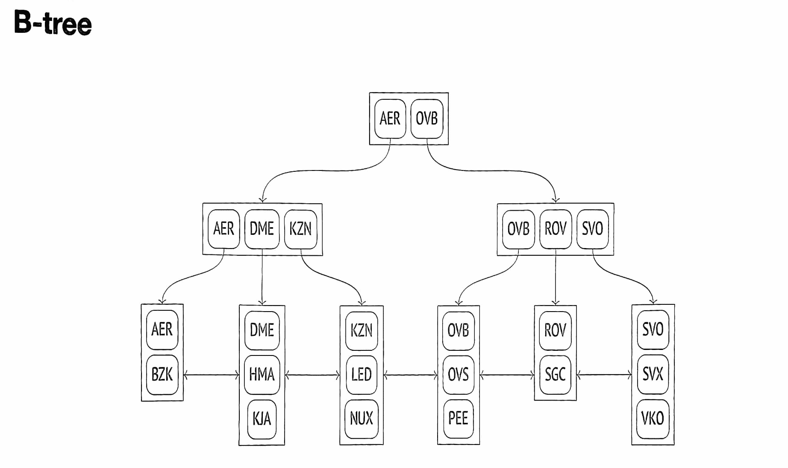

- Они сбалансированы, то есть все листья находятся на одной глубине. Поэтому поиск любого значения занимает одинаковое время.
- Они сильно ветвисты, то есть каждый узел содержит много элементов, часто сотни. За счет этого глубина В-деревьев получается небольшой даже для очень больших таблиц.
- Данные в индексе упорядочены по возрастанию как между узлами, так и внутри каждого узла. Узлы одного уровня связаны между собой двунаправленным списком.

**B-tree** 
- Поиск по равенству
- Поиск по неравенству
- Поиск по диапозону
- Поиск по префиксу
- Оптимизация сортировки
- Уникальность

- Дубликаты «схлопываются» в одну индексную запись, содержащую ключ и список табличных идентификаторов.
- Уникальные индексы могут содержать дубликаты ключей из-за многоверсионности, поскольку индекс хранит ссылки на все версии табличных строк.

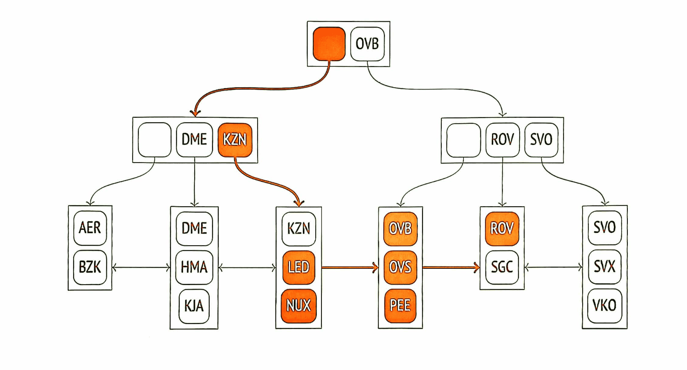

## GiST (Generalized Search Tree)
- Не конкретный тип индекса, а фреймворк, который позволяет создавать пользовательские реализации для различных видов данных.
## R-дерево
- Идея R-дерева состоит в том, что плоскость разбивается на прямоугольники, которые в сумме покрывают все индексируемые точки.
- Индексная запись хранит ограничивающий прямоугольник, а предикат можно сформулировать так: точка лежит внутри данного ограничивающего прямоугольника.

## k-NN
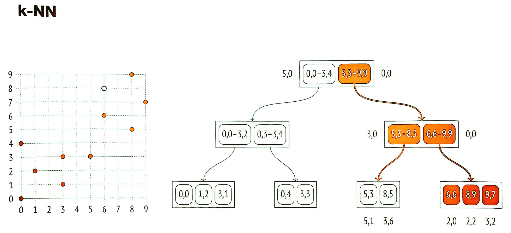

## R-дерево
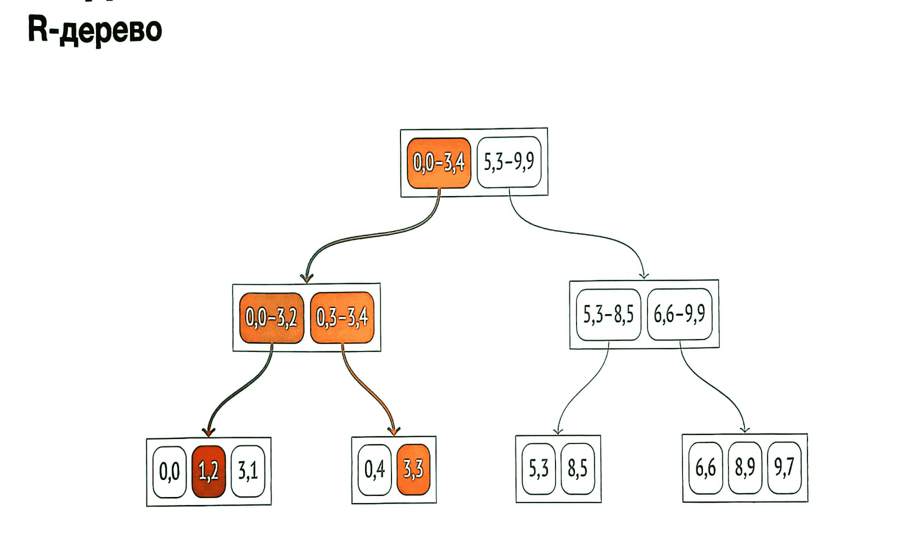
- Типичный запрос, ускоряемый индексом, получает все точки, входящие в заданную область.
## RD-дерево для полнотекстового поиска
- выбрать из набора документов те, которые соответствуют поисковому запросу.
- Для целей поиска документ приводится к специальному типу tsvector, который содержит лексемы и их позиции в документе.
### Полнотекстовый поиск
- Чтобы полнотекстовый поиск работал быстро, его нужно поддержать индексом. Поскольку индексируются не сами документы, а значения na tsvector, есть два варианта: построить индекс по выражению, с ведением типа, или создать отдельный столбец типа tsvector и индексировать его.
### RD-дерево
- R-дерево как таковое не годится для индексации документов, поскольку к ним неприменимо понятие ограничивающего прямоугольника.  Используется модификация этого подхода — RD-дерево (Russian Doll, матрешка).
- Вместо ограничивающего прямоугольника это дерево использует ограничивающее множество, то есть множество, содержащее все элементы дочерних множеств.
### Сигнатурное дерево

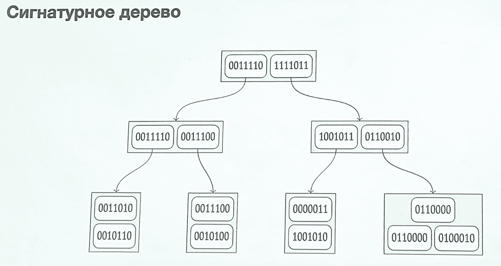
- В ней используется фильтр Блума. Каждую лексему можно представить своей сигнатурой: битовой строкой определенной длины, в которой все биты равны нулю (сброшены), кроме одного, который равен единице (установлен). Номер установленного бита определяется значением хеш-функции от лексемы.
### Индекс / Аналогия
- предметный указатель в конце книги.В указателе собраны все важные термины, и для каждого приведен список страниц, на которых этот термин упоминается. Чтобы указателем было удобно пользоваться, он оставляется по алфавиту, иначе в нем невозможно было бы быстро ориентироваться. Так и GIN полагается на то,что элементы составных значений можно упорядочить, и в качестве основной структуры использует b-tree
## GIN
- Тип индексной структуры, который предназначен для работы с коллекциями данных и для быстрого поиска по составным структурам. 
  Он особенно эффективен для ситуаций, когда одно поле содержит множество значений.

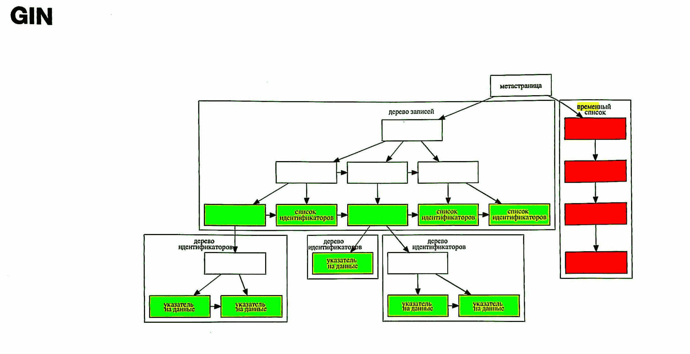


---

# Лекция 7
## Транзакции
ACID 
- Atomacity - Атомраность -Транзакци выполняется полностью или не выполнена совсем
- Consistency - Согласованность - После завершения транзакции бд остаётся в согласованном состоянии, то есть не возникает нарушений ограничений целостности
	- ограничения целостности
		- NOT nullUNIQUE
		- PRIMARY key
		- FOREIGN KEY
		- check - проверка условий
		- exclusion constrants - расширенные ограничения
- Isolation - Изоляция  - Параллельные транзакции выполняются так, как если бы они были последовательными, предотвращая конфликты данных
- Durability - Долговечность - После фиксации (COMMIT) изменения остаются в базе данных, даже если система выйдет из строя


## Изоляция транзакций
- read uncomitted - позволяет читаь даже незавершённые изменения других транзакиц (есть в sql, но не в постгресе)
- read commited (по умолчанию) - транзакция видит только зафиксированные (commi) изменения других транзакций
- repeatable read - транзакция видит данные в том виде, в каком они были на момент её начала, даже если другие транзакции вносят изменения
- serializable - максимальный уровень изоляции. Гарантирует, что параллельные транзакции выполняются так, как если бы они шли последовательно


## Аномалии
- Потерянное обновление - такая аномалия возникает, когда две транзакции читают одну и ту же строку таблицы, затем одна транзакция обновляет эту строку, а после этого вторая транзакция тоже обновляет ту же строку, не учитывая изменений, сделанных первой транзакцией
- Грязное чтение - такая аномалия возникает, когда транзакция читает еще не зафиксированные изменения, сделанные другой транзакцией
- Фантомное чтение - возникает тогда, когда транзакция два раза читает набор строк по одному и тому же условию, и в промежутке между чтениями вторая транзакция добавляет строки, удовлетворяющие этому условию (и фиксирует изменения), Тогда первая транзакция получает разные наборы строк

## Serializable
Уровень Serializable должен предотвращать вообще все аномалии. Это означает, что на таком уровне разработчику приложения не надо думать об одновременном выполнении. Если транзакции выполняют корректные последовательности операторов, работая в одиночку, данные будут согласованы и при одновременной работе этих транзакций 

## Аномалии сериализации
- Циклическая зависимость данных (Write skew)

#### Почему именно такие уровни в стандарте?
- Разница между уровнями изоляции стандарта объясняется как раз количеством необходимых блокировок
- Если транзакция блокирует изменяемые строки от изменения, но не от чтения, получаем уровень Read Uncommitted
- Если транзакция блокирует изменяемые строки и от чтения, и от изменения получаем уровень Read Committed
- Если транзакция блокирует и читаемые, и изменяемые строки и от чтения, и от изменения, получаем уровень Repeatable Read
- Но с Serializable проблема: невозможно заблокировать строку, которой еще нет. Из-за этого остается возможность фантомного чтения. поэтому для реализации уровня Serializable обычных блокировок не хватает - нужно блокировать не строки, а условия (предикаты). Такие блокировки и были названы предикатными

## Write-Ahead Logging
- стратегия, при которой все изменения данных сначала записываются в журнал, и только потом применяются к основным файлам базы данных.

	Структура WAL
	- Header (24 байта)
	- Page ID (8 байт)
	- Old Data (Размер страницы)
	- New Data (Размер страницы)
	- Checksum (8 байт)

```pascal
	fsync = on
	synchronous_commit = on
	wal_buffers = 64MB
```

### synchronous_commit
- on
- off
- local
- remote_write
- remote_apply

### checkpoint
- это процесс, при котором все изменяемые данные из буферного кэша сбрасываются на диск, создавая согласованное состояние базы данных

🌱 Авторы: \
salt-caramel \
notakeith

---

# Лекция 8

## хеш-таблица
- данные хранятся в файле, который можно только дополнять (append-only log)
- в оперативной памяти хранится хеш-таблица (словарь)
- ключ → смещение (offset) в файле данных

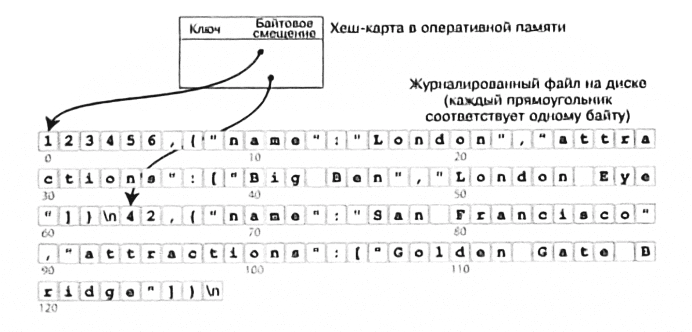

**Запись**: добавляем пару “ключ-значение” в конец файла и обновляем хещ-таблицу
**Чтение**: по ключу находим смещение в хеш-таблице, переходим по нему в файле и читаем значение

### Сегменты

- Разбить журнал на сегменты фиксированного размера.
- При заполнении сегмента - закрыть его и начать новый
- Запустить фоновый процесс уплотнения (compaction) и слияния (merging) сегментов

### Уплотнение

- Удаление дубликатов ключей
- Сохранение только самой последней версии значения для каждого ключа

### Слияние 
- Объединение нескольких небольших сегментов в один новый
- Позволяет уменьшить общее количество сегментов
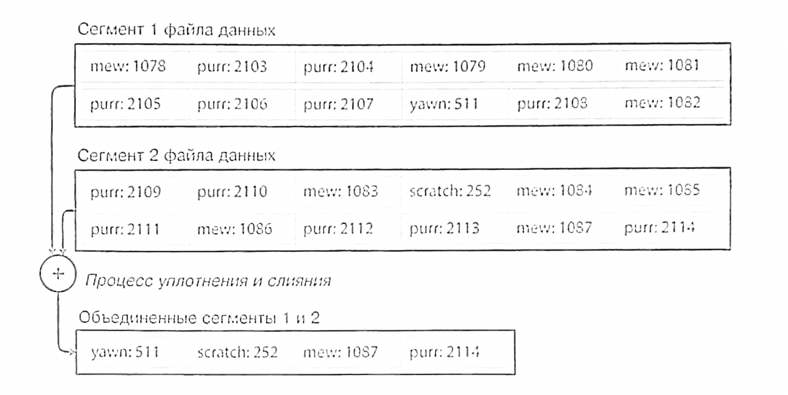

### Алгоритм чтения:
- Поиск начинается в хеш-таблице самого свежего сегмента
- Если ключ не найден – проверяется следующий по старшинству сегмент
- И так далее, пока ключ не будет найден или не будут проверены все сегменты

### Только добавление
- Высокая производительность записи: Последовательная запись на диск намного быстрее случайной
- Надежность: Упрощение конкретного доступа и восстановление после сбоев (нет риска “полузаписанных” данных)
- Борьба с фрагментацией: Процесс слияния сегментов естественным образом переписывает данные в компактном виде
## Ограничение 
- Ключи должны помещаться в ОЗУ. Хеш-таблица на диске медленная из-за случайных чтений, дорогого расширения и сложности разрешения коллизий.
- Неэффективные запросы по диапазону. Невозможно быстро найти все ключи от 00000 до 99999. Необходимо обращаться к хеш-таблице для каждого ключа в диапазоне отдельно.

## SS-table

### Особенности 
- Данные отсортированы по ключу
- Каждый ключ встречается только один раз (обеспечивается уплотнением)
- Порядок записи значений не важен - приоритет у более новых значений

### Слияние
- Алгоритм, аналогичный сортировке слиянием
- Работает даже когда данные не помещаются в оперативной памяти
- При конфликте ключей берется значение из самого нового сегмента

### Разряженный индекс

- Не нужно хранить все ключи - только некоторые ориентиры
- Пример: известны смещения для "handbag" и "handsome" → "handiwork" между ними
- Можно быстро просканировать небольшой диапазон

### MemTable
- Сбалансированное дерево в оперативной памяти (красно-черное, AVL)
- Данные сохраняются отсортированными по ключу
- Быстрая вставка в любом порядке
### Надежность 
- Все операции немедленно записываются в журнал
- Журнал неупорядочен - используется только для восстановления
- После записи MemTable в SS-таблицу журнал удаляется

### Алгоритм работы
- Запись: Добавляется в MemTable и параллельно пишется в журнал для надежности
- Чтение: Поиск в MemTable → последнем сегменте - предыдущем и т.д.
- Фоновые процессы: При превышении лимита MemTable записывается в SS-таблицу, Регулярное слияние и уплотнение сегментов

### Фильтр Блума
- Эффективная проверка отсутствия ключа
- Избегание ненужных чтений с диска
- "Возможно есть" / "Точно нет"

## Write-Ahead Log
- Файл только для добавления (append-only)
- Быстрая последовательная запись
- Используется для восстановления после сбоев

## Защелки (latches)

- Облегченные версии блокировок
- Защита структур данных при одновременном доступе
- Высокая производительность


- LSM-деревья: Обычно быстрее при записи
- В-деревья: Обычно быстрее при чтении

## Модель доступа

### Дискреционная модель доступа

- Модель управления доступом, при которой владельцы объектов (например, таблиц, схем, представлений) в базе данных самостоятельно определяют, кто и какие действия может выполнять с этими объектами.

## Роли
- B PostgreSQL понятие "пользователь" является частным случаем роли. Каждая роль может иметь или не иметь возможность входа в систему (login privilege). Если у роли установлено свойство LOGIN, она может использоваться как учетная запись пользователя.
- Роли могут быть членами других ролей. Это позволяет организовать группы пользователей - например, создать роль developers, которой будут принадлежать все разработчики, и назначить этой роли общие привилегии.

- Создание CREATE ROLE (Name} {attr, attr2, ...}
- Изменение ALTER ROLE developer WITH PASSWORD 'newsecret';
- LOGIN
- SUPERUSER
- CREATEDB
- CREATEROLE
- PASSWORD 'secret'

### Наследование привилегий
- роль, являющаяся членом другой роли, по умолчанию автоматически наследует все привилегии (права доступа) этой родительской роли.
- GRANT role1 to role2
- REVOKE role1 FROM role2


#### Привилегии таблиц
- SELECT
- INSERT
- UPDATE
- REFERENCES
- DELETE
- TRUNCATE
- TRIGGER

### Привилегии БД
- CREATE
- CONNECT
- TEMPERARY

%%Оффтоп
Truncate

- TRUNCATE не проверяет каждую строку для удаления, а просто освобождает данные, удаляя содержимое таблицы целиком.
- Вместо того, чтобы логировать каждое удаление строки, TRUNCATE записывает в журнал меньший объем информации.
- При использовании TRUNCATE не вызываются триггеры, определенные для операций удаления.
- Если TRUNCATE выполняется в транзакционном блоке, то операция может быть отменена командой ROLLBACK до фиксации транзакции.%%
  
### Привилегии схем
- CREATE
- USAGE
- Права доступа к схеме влияют на возможность создания новых объектов, но сами по себе не контролируют доступ к уже существующим объектам. Для этого необходимо назначать соответствующие привилегии непосредственно на уровне объектов

🌱 Авторы: \
salt-caramel \
notakeith

---

# Лекция 9
# Этапы выполнения запроса

### Лексический разбор

- На этом этапе сервер принимает SQL-текст запроса и анализирует его на наличие синтаксических ошибок. Результатом является дерево разбора (parse tree), представляющее структуру

### Семантический разбор

- Заменяет представления на их определения или обрабатывает правила, определённые для таблиц.
- Проверка прав у пользователя к этим объектам.
- Вся необходимая для семантического анализа информация хранится в системном каталоге.
- Семантический анализатор получает от синтаксического анализатора дерево разбора и перестраивает его, дополняя ссылками на конкретные объекты базы данных, указанием типов данных и другой информацией.

### Планирование

- Любой запрос можно выполнить разными способами.
- План выполнения также представляется в виде дерева, но его узлы содержат не логические, а физические операции над данными.
- Текстовое представление плана выводит команда EXPLAIN
- Планировщик (planner) принимает переписанное дерево запроса и генерирует один или несколько вариантов выполнения запроса.
- Оптимизатор оценивает стоимость каждого варианта плана, используя статистические данные о таблицах, и выбирает наиболее выгодный план.


### Планы

- Количество возможных планов экспотенциально зависит от количества соединяемых таблиц.
- Для сокращения пространства перебора традиционно используется алгоритм динамического программирования в сочетании с некоторыми эвристиками.
- Точное решение задачи оптимизации не гарантирует, что найденный план действительно будет лучшим.


### Выбор лучшего плана

#### Общие и частные планы

- При выполнении подготовленных запросов план выполнения может быть сохранён и повторно использован.
- Общий план, который строится один раз без учёта конкретных значений параметров, предоставленных во время исполнения.
- Частный План, который создаётся при каждом выполнении подготовленного запроса и учитывает конкретные значения параметров.

- При первом выполнении подготовленного запроса PostgreSQL планирует его с учётом переданных параметров частный план. Однако, если запрос будет выполнен многократно, система переходит к общему плану.
- Если общее выполнение оказывается более выгодным по суммарным затратам, то PostgreSQL будет использовать общий план для последующих вызовов.


## Выполнение

- После выбора оптимального плана исполнитель запускает последовательность операций, предусмотренных планом. Он последовательно проходит по узлам плана.
- При выполнении запросов осуществляется доступ к данным через буферный менеджер, который минимизирует количество операций ввода-вывода на диск.
- Если запрос рассчитан на параллельное выполнение, результат собирается из нескольких рабочих процессов и объединяется в итоговый набор данных.

## Определение
- это набор данных, который собирается системой для оценки распределения значений в таблицах и столбцах, что затем используется планировщиком запросов для выбора наиболее эффективного плана выполнения.

# Статистика
### Хранение

- PostgreSQL хранит собранную статистику в системной таблице pg_statistic
- Прямой доступ к pg_statistic обычно не требуется, и для просмотра статистики чаще используют представление pg_stats
- Это публичное представление, которое предоставляет информацию из pg_statistic в удобном для чтения виде, без избыточных деталей, доступных только суперпользователям.
- Базовая статистика уровня отношения хранится в таблице pg_class

## Данные
- reltuples: число кортежей в отношении.
- n_distinct: оценка количества уникальных значений.
- most_common_vals и most_common_freqs: список наиболее часто встречающихся значений и их частоты.
- histogram_bounds: границы гистограммы распределения значений, которые используются для оценки селективности диапазонных запросов.
- correlation: оценка корреляции между порядком значений в столбце и порядком их хранения.
- null_frac: Доля неопределенных значений

## Сбор статистики

- Статистика собирается при анализе, ручном или автоматическом. Однако ввиду особой важности базовая статистика рассчитывается также при выполнении некоторых операций (VACUUM FULL и CLUSTER, CREATE INDEX и REINDEX) и уточняется при очистке.
- Для анализа случайно выбираются 300 x default_statistics_target строк. Поскольку размер выборки, достаточной для построения статистики заданной точности, слабо зависит от объема анализируемых данных, размер таблицы не учитывается.

## pg_stats

- Для уточнения оценки при неравномерном распределении собирается статистика по наиболее часто встречающимся значениям и частоте их появления. Представление pg_stats показывает два этих массива в столбцах most_common_vals и most_common_freqs.
- Список частых значений используется и для оценки селективности условий с неравенствами. Например, для условия вида «столбец < значение»: надо найти в most common_vals все значения, меньшие искомого, и просуммировать частоты из most_common_ freqs.

- Поле correlation представления pg_stats показывает корреляцию между физическим расположением данных и логическим порядком в смысле операций сравнения. Если значения хранятся строго по возрастанию, корреляция будет близка к единице; если по убыванию - к минус единице. Чем более хаотично расположены данные на диске, тем ближе значение к нулю.
- Корреляция используется для оценки стоимости индексного сканирования.


# Табличные методы доступа

## Последовательное сканирование
- полностью читается файл основного слоя таблицы. На каждой прочитанной странице проверяется видимость каждой версии строки
- Чтение происходит через буферный кеш; чтобы большие таблицы не вытесняли полезные данные. При этом другие процессы, одновременно сканирующие ту же таблицу, присоединяются к кольцу и тем самым акономят операции дисковых чтений. Поэтому в общем случае сканирование может стартовать не о начала файла
- Последовательное сканирование - самый аффективный способ прочитать всю таблицу или значительную ее часть. Иными словами, последовательное сканирование хорошо работает при низкой селективности.

Агрегация

- Hash Aggregation
- GroupAggregate

- Входные данные должны быть отсортированы по ключам группировки
- Данные читаются в отсортированном порядке, и когда встречается новое значение ключа группировки, текущая группа завершается
- Не требует хранения всей хеш-таблицы в памяти


# СТЕ

• Идея была в том, что если какой-то вложенный подзапрос используется в запросе несколько раз, то его можно определить как общее табличное выражение и ссылаться на него столько раз, сколько потребуется. В этом случае PostgreSQL вычислит результаты только один раз и повторно использует их при повторных обращениях.


# Shared buffers

• Представляют собой оперативную память, где PostgreSQL хранит копии страниц таблиц и индексов. Когда запрос требует доступ к данным, сервер сначала ищет их в этом кэше. Если страница найдена (hit), запрос выполняется быстрее, чем в случае обращения к диску.


# Explain

- Тип операций (узлов) плана
- Оценки стоимости (cost). cost=START_COST..END_COST
- Оценка количества строк
- Размер данных (width)
- Параллельное выполнение
- Фактическое время выполнения. Время, затраченное на выполнение каждой операции.
- Фактическое количество строк. Сколько строк реально обработано на каждом этапе.
- Число циклов/итераций

# Виды и способы соединений

## Соединение хешированием

• Реализация использует динамически расширяемую хеш-таблицу с разрешением коллизий с помощью цепочек, как для буферного кеша.

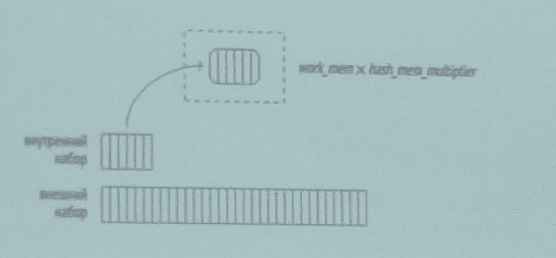

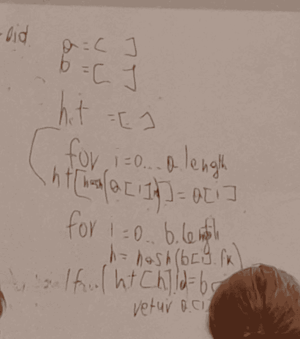

## Соединение хешированием в параллельных планах

- Соединение хешированием очень эффективно для больших наборов данных. При наличии достаточного объема оперативной памяти оно требует однократного просмотра двух наборов данных, то есть имеет линейную сложность.
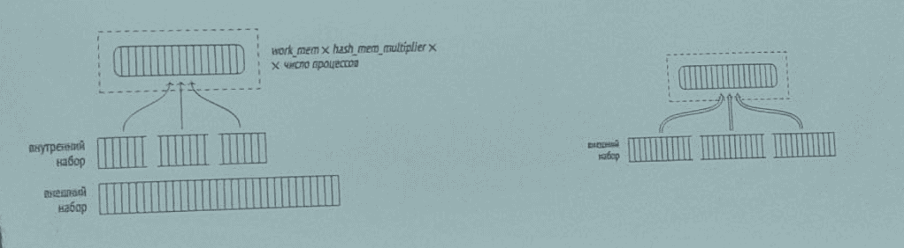


- Соединение слиянием работает для наборов данных, отсортированных по ключу соединения, и возвращает отсортированный же результат. Входной набор может оказаться уже отсортированным в результате индексного сканирования, или он может быть отсортирован явно.
- Используется Быстрая сортировка, Частичная пирамидальная сортировка, внешняя сортировка слиянием.

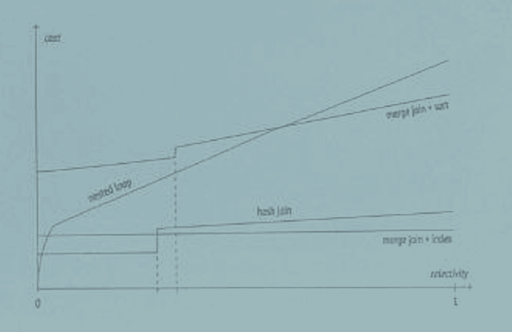

# Сортировки

- PostgreSQL использует quicksort, чтобы выполнить операцию в оперативной памяти. Размер выделенной памяти для сортировки контролируется параметром work_mem.
- Если объем данных превышает значение work_mem, PostgreSQL может производить сортировку с временным сохранением промежуточных результатов на диске.
- В новых версиях PostgreSQL поддерживается параллельное выполнение операций сортировки.

# Табличные методы доступа / Последовательное сканирование

- полностью читается файл основного слоя таблицы. На каждой прочитанной странице проверяется видимость каждой версии строки
- Чтение происходит через буферный кеш; чтобы большие таблицы не вытесняли полезные данные. При этом другие процессы, одновременно сканирующие ту же таблицу, присоединяются к кольцу и тем самым экономят операции дисковых чтений. Поэтому в общем случае сканирование может стартовать не с начала файла.
- Последовательное сканирование - самый эффективный способ прочитать всю таблицу или значительную ее часть. Иными словами, последовательное сканирование хорошо работает при низкой селективности.

- В оценке стоимости оптимизатор учитывает две составляющие: дисковый ввод-вывод и ресурсы процессора
- Стоимость ввода-вывода рассчитывается как произведение числа страниц в таблице на стоимость чтения одной страницы, при условии что страницы читаются последовательно.
- Соотношение по умолчанию подходит для HDD-дисков; для накопителей SSD имеет смысл существенно уменьшить значение параметра random_page_cost (значение seq_page_cost, как правило, не трогают, оставляя единицу в качестве опорного значения).
- Оценка ресурсов процессора учитывает стоимость обработки каждой версии строки (которая определяется для планировщика значением параметра сри_tuple_cost):
- Если на сканируемую таблицу наложены условия, они отображаются в плане запроса под узлом Seq Scan в секции Filter. Оценка числа строк будет учитывать селективность этих условий, а оценка стоимости - затраты на их вычисления.

## Parallel Seq Scan - «параллельное последовательное сканирование».

- чтение выполняется несколькими параллельно работающими процессами. Процессы синхронизируются между собой с помощью специально отведенного участка общей памяти, чтобы не прочитать одну и ту же страницу дважды.

## Gather
- собирает результаты от параллельных рабочих процессов.
- Gather Merge: В этом случае параллельные рабочие процессы выполняют сортировку локально, а Gather Merge объединяет отсортированные потоки, гарантируя, что итоговый результат также будет отсортирован без выполнения дополнительной сортировки на этапе объединения.

## Табличные методы доступа
### Сканирование только индекса

- Операция представляется в плане запроса узлом Index Only Scan
- На оценку сканирования только индекса влияет доля табличных страниц, отмеченных в карте видимости.

### Сканирование по битовой карте

- Ограничение индексного сканирования связано с тем, что при уменьшении корреляции увеличивается количество обращений к страницам, а характер чтения меняется с последовательного на случайный.

### Сравнение методов доступа
- Зависимость стоимости различных методов доступа от селективности условий можно представить следующим образом
- Стоимость индексного сканирования сильно зависит от корреляции.  
    При идеальной корреляции индексное сканирование эффективно даже при довольно большой доле выбираемых строк.


## Соединение вложенным циклом
- эффективность соединения вложенным циклом влияет нескольких условий: кардинальность внешнего набора строк, наличие метода доступа ко внутреннему набору, позволяющего эффективно получить нужные строки, повторные обращения к одним и тем же строкам внутреннего набора.
- В общем случае полная стоимость соединения складывается: из стоимости получения всех строк внешнего набора, однократной стоимости первоначального получения всех строк внутреннего набора (в ходе которого выполняется материализация), (N-1) кратной стоимости повторного получения строк внутреннего набора, стоимости обработки каждой строки результата.


🌱 Авторы: \
salt-caramel \
notakeith

---

# Лекция 10
## Что такое безопасная система?

Безопасная система - это система, которая защищена от несанкционированного доступа, использования, раскрытия, нарушения, модификации или уничтожения, тем самым обеспечивая конфиденциальность, целостность и доступность данных и функций.


## CIA Triad

- Конфиденциальность (Confidentiality)
- Целостность (Integrity)
- Доступность (Availability)

## Определение пользователя

- Идентификация - процесс, когда информационная система определяет, существует конкретный пользователь или нет. Делает она это с помощью идентификатора. Идентификатором может быть логин, электронная почта, номер телефона или другой признак, который есть только у одного пользователя.
- Аутентификация - процесс, когда пользователь вводит ключ, например пароль или пин-код, подтверждая своё право на доступ к той или иной учётной записи и хранящейся в ней информации
- Авторизация - процесс определения того, какие действия позволено совершать аутентифицированному пользователю.

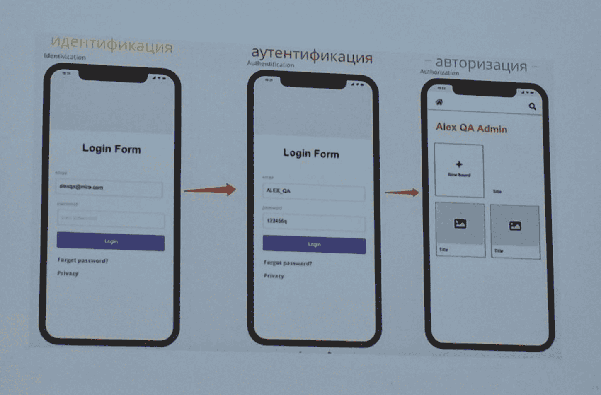


## Идентификация

- То, что субъект знает
- То, что субъекту принадлежит
- То, что является неотьемлемой характеристикой субъекта

## Многофакторная идентификация

- Если для входа требуются пароль и, например, ответ на секретный вопрос (который тоже является "знанием"), то это не многофакторная аутентификация, а всего лишь двухэтапная проверка в рамках одного фактора.

## Авторизация
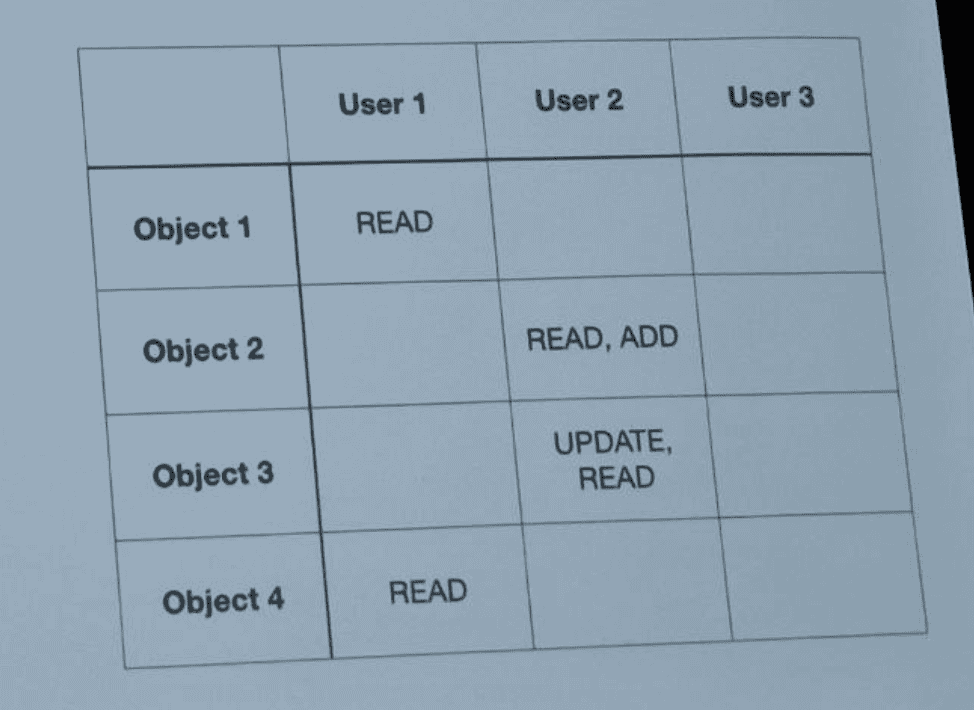

## Дискретный уровень доступа
- Каждый объект имеет владельца
- Владелец полностью контролирует доступ к своему объекту
- Права доступа определяются на основе списков контроля доступа (ACL)

- SELECT *
- FROM pg_class

### Виды привилегий 
- SYSTEM PRIVILEGES
- DATABASE PRIVILEGES
- SCHEMA PRIVILEGES
- TABLE PRIVILEGES
- COLUMN PRIVILEGES
- ROW-LEVEL PRIVILEGES

## Модель доступа: Владелец объекта
- B PostgreSQL каждый объект базы данных имеет владельца, который создаёт этот объект. Этот владелец обладает полным контролем над объектом.
- По умолчанию владелец объекта может передавать свои права другим ролям, позволяя им выполнять определённые действия с объектом.


## Модель доступа: Пользователи и группы
-  Реализована через концепцию ролей, которая служит для управления доступом и правами пользователей к объектам базы данных. В этой системе каждая роль может выступать как в роли пользователя, так и в роли группы пользователей.

## Роли
- B PostgreSQL понятие "пользователь" является частным случаем роли. Каждая роль может иметь или не иметь возможность входа в систему (login privilege). Если у роли установлено свойство LOGIN, она может использоваться как учетная запись пользователя.
- Роли могут быть членами других ролей. Это позволяет организовать группы пользователей - например, создать роль developers, которой будут принадлежать все разработчики, и назначить этой роли общие привилегии.

- Создание CREATE ROLE {Name) {attr1, attr2, ...}
- Изменение ALTER ROLE developer WITH PASSWORD 'newsecret';
- LOGIN
- SUPERUSER
- CREATEDB
- CREATEROLE
- PASSWORD 'secret'


## Наследование привилегий
- роль, являющаяся членом другой роли, по умолчанию автоматически наследует все привилегии (права доступа) этой родительской роли.
- GRANT role1 to role2
- REVOKE role1 FROM role2

## Смена владельца
- ALTER {obj} OWNER TO {role1}
- Владеет роли и роли включающиеся в нее

#### Привилегии таблиц
- SELECT
- INSERT
- UPDATE
- REFERENCES
- DELETE
- TRUNCATE
- TRIGGER

### Привилегии БД
- CREATE
- CONNECT
- TEMPERARY

%%Оффтоп
Truncate

- TRUNCATE не проверяет каждую строку для удаления, а просто освобождает данные, удаляя содержимое таблицы целиком.
- Вместо того, чтобы логировать каждое удаление строки, TRUNCATE записывает в журнал меньший объем информации.
- При использовании TRUNCATE не вызываются триггеры, определенные для операций удаления.
- Если TRUNCATE выполняется в транзакционном блоке, то операция может быть отменена командой ROLLBACK до фиксации транзакции.%%
  
### Привилегии схем
- CREATE
- USAGE
- Права доступа к схеме влияют на возможность создания новых объектов, но сами по себе не контролируют доступ к уже существующим объектам. Для этого необходимо назначать соответствующие привилегии непосредственно на уровне объектов

## Состояние


## Strict


## Diagnostics
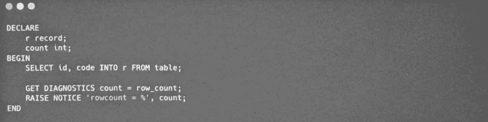


## Подпрограммы PL / pgSQL
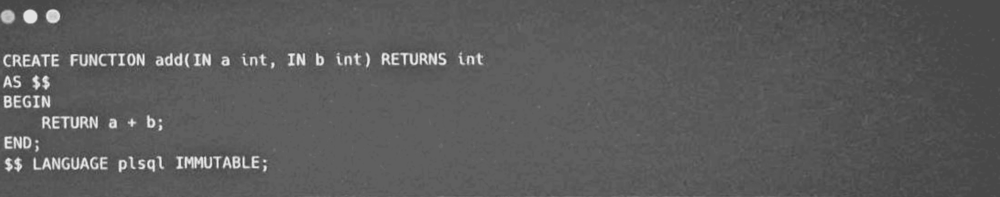

## Используя OUT аргумент
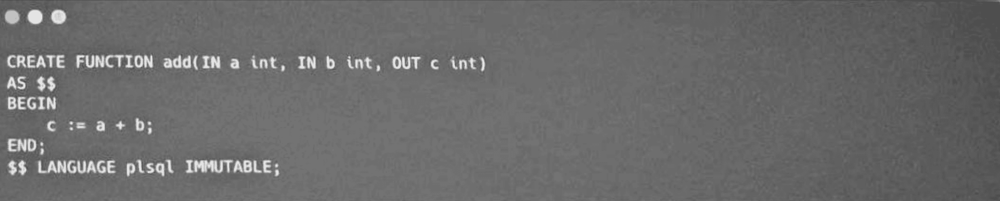

## Условные операторы
- IF
- CASE (не возвращает значение)

## IF
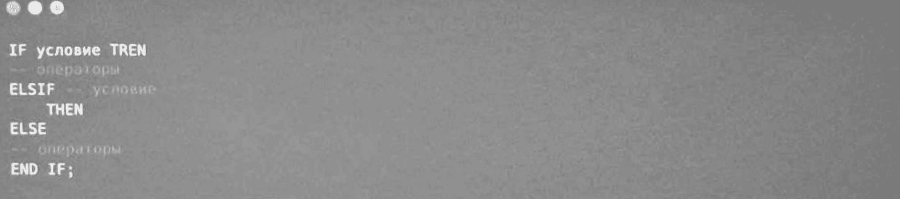

## Оффтоп
### Схема public
- Создаётся по умолчанию при создании новой базы данных.
- Объекты, в ней, доступны всем пользователям, если не настроены отдельные ограничения.
- При создании объектов не указана какая-либо другая схема, они автоматически создаются в public.

## Модель доступа
### Привилегии БД
- CREATE
- CONNECT
- TEMPERARY

## Оффтоп 
### Стандартные БД
- Когда создаётся новая база данных без явного указания шаблона, используется база данных template1.
- Template - это «чистая» база данных, которая не изменялась после установки PostgreSQL. Она содержит минимальное количество объектов и служит эталоном.

### Привилегии схем
- CREATE
- USAGE
- Права доступа к схеме влияют на возможность создания новых объектов, но сами по себе не контролируют доступ к уже существующим объектам. Для этого необходимо назначать соответствующие привилегии непосредственно на уровне объектов

## Мандатный доступ
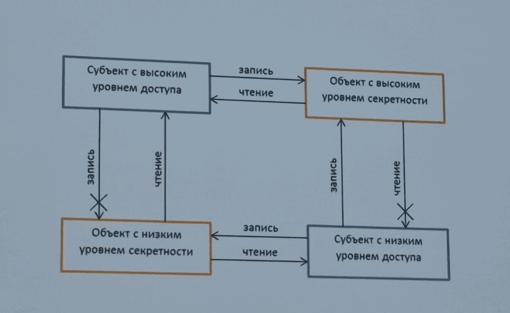

Мандатный уровень доступа (Mandatory Access Control - MAC)

используется в системах, где требуется высший уровень безопасности и централизованный контроль. В отличие от дискреционной модели, где владелец решает, кому предоставить доступ, в МАС доступ определяется системными политиками.


- "Нет права давать права"
- Протоколирование ВСЕХ действий
- Защита от копирования

## Шифрование БД

- прозрачное шифрование
- на уровне столбцов
- на уровне приложения

## Угроза действий привилегированных пользователей 
- Принцип разделения обязанностей
- Принцип наименьших привилегий

## Для чего они используются

Циклы

- For
- While
- Loop

Циклы имеют операторы ЕХІТ и CONTINUE


## For
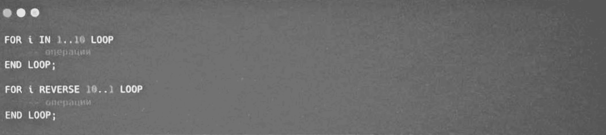

## Триггеры 
Используются когда мы хотим действия в момент изменения данных
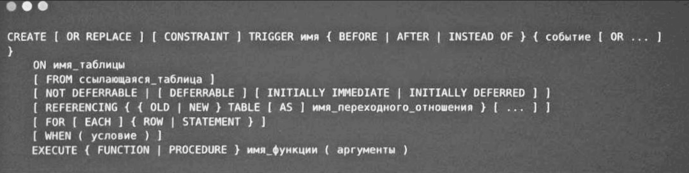


- BEFORE/AFTER - Выполняется перед действием или после. Если используем перед, то мы можем менять данные.
- FROM - на какую то таблицу
- FOR ROW/STATEMENT - На весь запрос целиком или на каждую строчку. У стейтмент триггера нет информации об измененных данных
- WHEN - содержит условие, определяющее будет ли вызываться функция или нет.

## Переменные триггера

- NEW - Содержит новую строку
- OLD - Содержит старую строку
- TG_NAME - Содержит название триггера
- TG_OP - Содержит название операции
- TG_TABLE_NAME - Содержит название таблицы

## Пример триггера 


## Плюсы

- Инкапсулирование функциональности
- Изоляция пользователей от таблиц.
- В некоторых случаях ускорение выполнения (Предкомпиляция)

## Минусы

- Повышение нагрузки на БД
- Миграция между СУБД вызывает проблемы. Обратной совместимости нет совсем.

## В чем отличие?

|                                                                                                       |                                                                                 |
| ----------------------------------------------------------------------------------------------------- | ------------------------------------------------------------------------------- |
| • Функция имеет возвращаемый тип и возвращает значение                                                | • Может не возвращать значение или возвращать через OUTPUT параметры            |
| • Использование DML запросов<br>внутри функции невозможно. В функциях разрешены только SELECT-запросы | • Использование DML-запросов возможно в хранимой процедуре.                     |
| • Вызов хранимой процедуры из функции невозможно                                                      | • Использование или же управление<br>транзакциями возможно в хранимой процедуре |
| • Вызов функции внутри SELECT запросов возможен                                                       | • Вызов хранимой процедуры из SELECT запросов невозможно                        |

## Создание функции
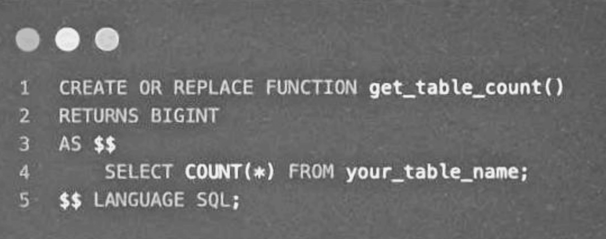


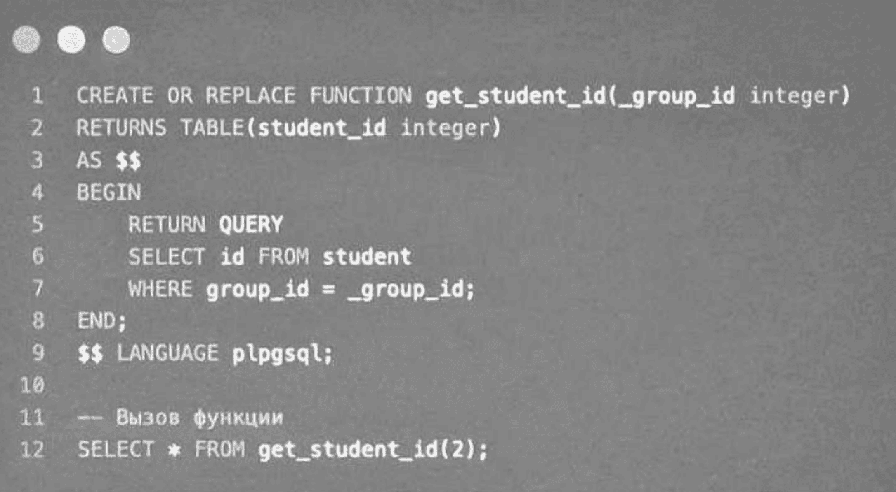

Функции

- Функции могут состоять из нескольких операторов SQL.
- Возвращается значение из RETURN
- Нельзя использовать операторы управления транзакции (BEGIN,  COMMIT, ROLLBACK)
- Нельзя использовать служебные команды (CREATE INDEX)

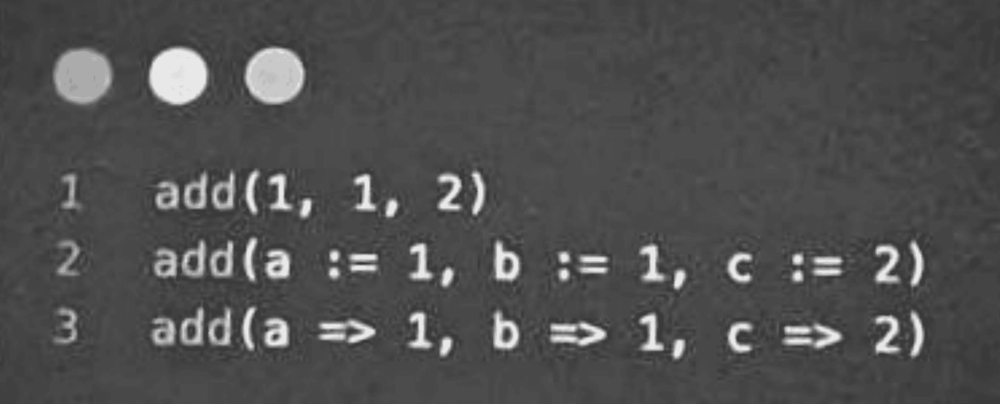


## Типы переменных

- IN
- OUT
- INOUT
- RETURN

## Привилегии доступа

- Definer - Создателя
- Invoker - Вызывающего

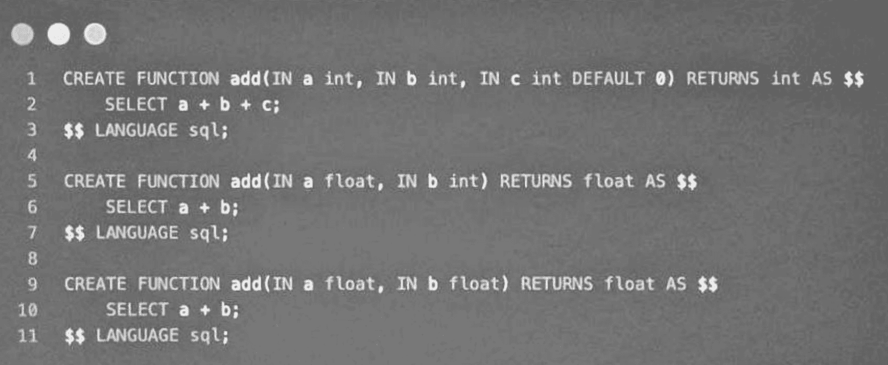
- ! это перегрузка процедур, а не функций и ретурна нет (в процедурах), только ин и аут

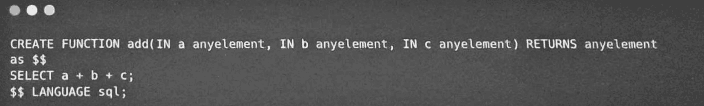

## Категории изменчивости

- Volatile - возвращаемое значение может быть произвольно менять на одних и тех же входных.
- Stable - Значение не меняется в рамках одного оператора, функция не может менять таблицы (Оптимизатор может кэшировать результаты в пределах команды)
- Immutable - значение не меняется, функция детерминирована, функция не может менять таблицы (Можно вызывать на этапе планирования запроса)
 


## PL/pgSQL

это загружаемый процедурный язык для системы управления базами данных.
- может быть использован для создания функций, процедур и триггеров
- добавляет структуры управления к языку SQL
- наследует все пользовательские типы, функции, процедуры и операторы
- прост в использовании

Структура

- Метка
- Секция объявления переменных
- Операторы
- Обработка исключительных ситуаций

## Форма блока  


🌱 Авторы: \
salt-caramel \
notakeith

---

# Лекция 11
*(в этой части конспекта курсив – комментарии, остальной текст – презентация)*

*Когда строим какую-либо реляционную систему, 3 части:*
- *клиентская*
- *бэкенд*
- *база данных*

*Нужно масштабироваться. Можно делать это вертикально, но упрёмся в производительность. Тогда проще сделать много серверов. Бд разделены на несколько устройств*
## Определение
- Распределенная база данных - это набор логически взаимосвязанных данных, которые физически распределены между несколькими узлами в некоторой компьютерной сети.
### Мотивация
- Масштабируемость
- Высокая доступность и отказоустойчивость
- Производительность
### Модели распределения данных
- Репликация
	*Если репликация, то соединённые ноды имеют одни и те же данные*
	*одна сломалась - в другой всё осталось(отказоустойчивость)*
	*повышается производительность*
- Шардинг
	*Если шардинг, то в разных нодах разные данные.*
	*нода упала - половина данных недоступна*
- Replication + Sharding
### РБД?
- Партиционирование - это вертикальное разделение таблицы по строкам внутри одной базы данных
## Репликация
- Синхронная
- Асинхронная
## Архитектуры реплицирования
- Master-Slave
	*Есть одна нода - мастер, остальные будут её слейвы. Ограничения там на чтение и запись...*
	*Мастеры могут писать и читать, а а слейв только читать?*
- Multi-Master
	*любая реплика тоже мастер*
- Peer-to-Peer
	*каждая нода - полноценный, независимый организм*
## Стратегии шардирования
- Шардирование по диапазону *(самый простой вариант)*
- Шардирование по хэшу
- Шардирование по справочнику
- Геошардинг
## Проблемы шардирования
- Сложность запросов (JOINs)
- Транзакции (требует дорогих Two-Phase Commit)
- Решардинг *(Решардинг - перераспределение данных - очень дорого при шардировании)*
- Роутинг запросов (нужен координатор)
- Неподходящие ключи шардирования
- Кайфанешь от SELECT COUNT(*)
## Типы распределенных СУБД
- Однородные (Homogeneous)
- Неоднородные (Heterogeneous)
## Two-Phase Commit
- Фаза подготовки
- Фаза решения
### недостатки 2РС
- Протокол требует двух раундов сетевого взаимодействия
- Каждая транзакция ждет ответов от всех участников
- Координатор - единая точка отказа

*альтернатива 2РС: делаем маленький операции на уровне микросервисов*
### BASE
- BASE — это свойство, которая жертвует немедленной строгой согласованностью в обмен на высокую доступность и производительность.
### BASE
- Basically Available - Система отвечает на любой запрос, но этот ответ может быть содержать ошибку или несогласованные данные.
- Soft-state - Состояние системы может меняться со временем из-за изменений конечной согласованности.
- Eventual consistency - Система, в конечном итоге, станет согласованной. Она будет продолжать принимать данные и не будет проверять каждую транзакцию на согласованность.
## CAP
САР теорема (теорема Брюера) - утверждает, что в любой распределенной системе, обеспечивающей хранение данных, невозможно одновременно гарантировать более двух из трех свойств.

- Consistency - информация на разных узлах согласована
- Availability - система отвечает на запросы в любой момент времени
- Partition tolerance - связи между узлами могут обрываться
### CP
- При разрыве связи между узлами система блокирует запись на часть узлов, чтобы гарантировать, что данные останутся согласованными.
- Примеры: MongoDB, Redis, ZooKeeper
### AP
- При разрыве связи все узлы остаются доступными для чтения и записи.
  Это может привести к тому, что разные узлы будут иметь разные версии данных
- Примеры: Cassandra, Scylla.
### CA
Такая система может существовать только при отсутствии сетевых сбоев.

***
Идея нового сервиса — «Позвони, напомню!»
- Система хранения фактов с разрешенными действиями:
	- Запрос на запись факта;
	- Запрос на изменение факта;
	- Запрос на чтение факта.

[Продолжение читать тут...](https://habr.com/ru/articles/130577/?ysclid=miehivg6ll142623475)
***
### PACELC
-  PACELC - расширяет САР, описывая поведение системы не только во время сетевых сбоев, но и в нормальных условиях работы.
- Если произошел Р, то выбираем между А и С
- (E)lse выбираем между: L и С

 
